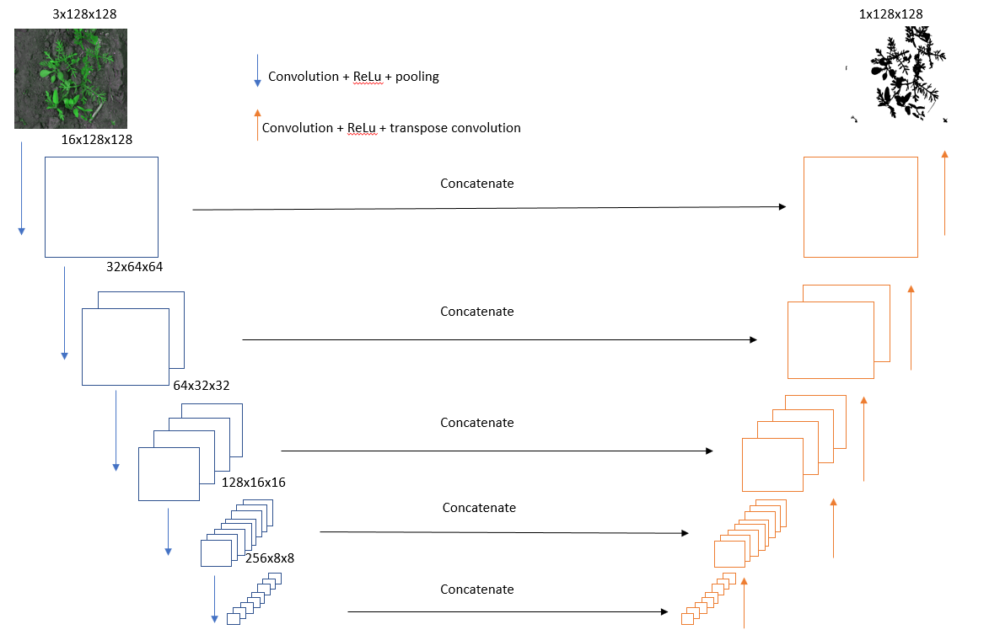
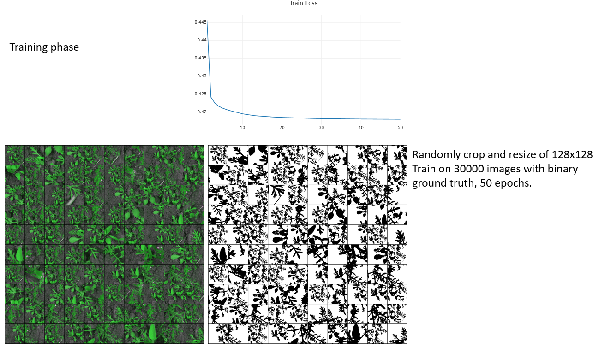
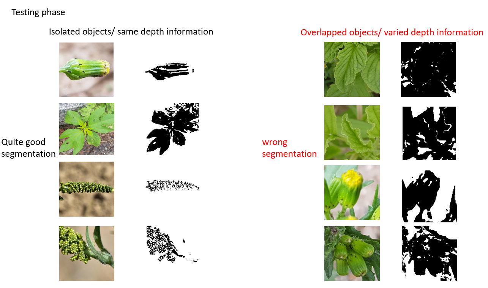

# Simple-Unet

## Experiments on Weed dataset
This repository contains Unet model written in Pytorch framework

  
Figure 1. Unet architecture  

  
Figure 2. Training phase  

  
Figure 3. Testing phase  

## Experiments on Lungs CT dataset

Dataset: [Finding and Measuring Lungs in CT Data](https://www.kaggle.com/datasets/kmader/finding-lungs-in-ct-data)

